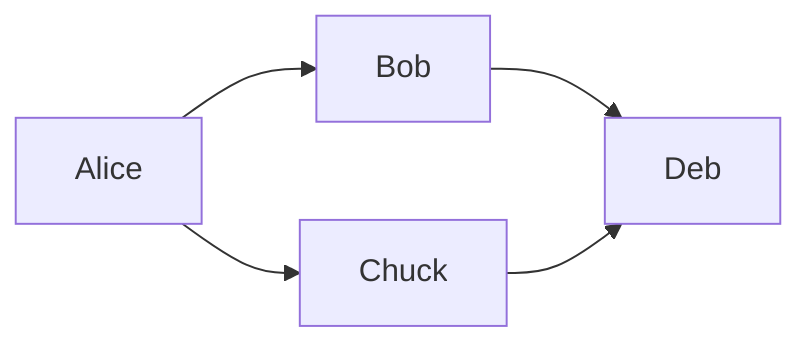

* [Sources](https://github.com/Nasdanika/core/tree/master/exec)
* [Javadoc](https://javadoc.io/doc/org.nasdanika.core/exec/latest/org.nasdanika.exec/module-summary.html)

## Markdown 

This section demonstrates advanced capabilities of Markdown documentation provided by [MarkdownDocumentationFactory](https://javadoc.io/doc/org.nasdanika.core/exec/latest/org.nasdanika.exec/org/nasdanika/exec/util/MarkdownDocumentationFactory.html). 

### Embedded images

You can embed PNG and JPEG using fenced blocks.

#### PNG resource

    ```png-resource
    isa.png
    ```

Resource location is resolved relative to the diagram file location.

#### JPEG resource

    ```jpeg-resource
    my.jpeg
    ```

#### PNG

    ```png
    Base 64 encoded png 
    ```
#### JPEG

    ```jpeg
    Base 64 encoded jpeg
    ```

### Embedded diagrams

You can also embed [PlantUML](https://plantuml.com/), Drawio, and [Mermaid](https://mermaid-js.github.io/mermaid/#/) diagrams using fenced blocks. 

#### Drawio

    ```drawio-resource
    aws.drawio
    ```

Resource location is resolved in the same way as for image files as explained above.

#### PlantUML

PlantUML diagrams can be defined inline or loaded from resources.

##### Loading from a resource

    ```uml-resource
    sequence.plantuml
    ```

##### Inline 

The following language specifications (dialects) are supported:

* ``uml`` - for the following diagram types:
    * [Sequence](https://plantuml.com/sequence-diagram), 
    * [Use Case](https://plantuml.com/use-case-diagram), 
    * [Class](https://plantuml.com/class-diagram), 
    * [Activity](https://plantuml.com/activity-diagram-beta), 
    * [Component](https://plantuml.com/component-diagram), 
    * [State](https://plantuml.com/state-diagram), 
    * [Object](https://plantuml.com/object-diagram), 
    * [Deployment](https://plantuml.com/deployment-diagram), 
    * [Timing](https://plantuml.com/timing-diagram), 
    * [Network](https://plantuml.com/nwdiag).
* ``wireframe`` - for [Wireframe diagrams](https://plantuml.com/salt)
* ``gantt`` - for [Gantt diagrams](https://plantuml.com/gantt-diagram)
* ``mindmap`` - for [Mind Maps](https://plantuml.com/mindmap-diagram)
* ``wbs`` - for [Work Breakdown Structures](https://plantuml.com/wbs-diagram)

###### UML

**Sequence**

Fenced block:

    ```uml
    Alice -> Bob: Authentication Request
    Bob --> Alice: Authentication Response
    ```
    
Diagram:

```uml
Alice -> Bob: Authentication Request
Bob --> Alice: Authentication Response
```

**Component**

Component diagram with links to component pages.


Fenced block:

    ```uml
    package Core {
       component Common [[https://github.com/Nasdanika/core/tree/master/common]]
    }
    
    package HTML {
       component HTML as html [[https://github.com/Nasdanika/html/tree/master/html]]
       [html] ..> [Common]
    }
    ```
    
Diagram:

```uml
package Core {
   component Common [[https://github.com/Nasdanika/core/tree/master/common]]
}

package HTML {
   component HTML as html [[https://github.com/Nasdanika/html/tree/master/html]]
   [html] ..> [Common]
}
```

**Wireframe**

Fenced block:

    ```wireframe
    {
      Just plain text
      [This is my button]
      ()  Unchecked radio
      (X) Checked radio
      []  Unchecked box
      [X] Checked box
      "Enter text here   "
      ^This is a droplist^
    }
    ```


Diagram:

```wireframe
{
  Just plain text
  [This is my button]
  ()  Unchecked radio
  (X) Checked radio
  []  Unchecked box
  [X] Checked box
  "Enter text here   "
  ^This is a droplist^
}
```

**Gantt**

Fenced block:

    ```gantt
    [Prototype design] lasts 15 days and links to [[https://docs.nasdanika.org/index.html]]
    [Test prototype] lasts 10 days
    -- All example --
    [Task 1 (1 day)] lasts 1 day
    [T2 (5 days)] lasts 5 days
    [T3 (1 week)] lasts 1 week
    [T4 (1 week and 4 days)] lasts 1 week and 4 days
    [T5 (2 weeks)] lasts 2 weeks
    ```

Diagram:

```gantt
[Prototype design] lasts 15 days and links to [[https://docs.nasdanika.org/index.html]]
[Test prototype] lasts 10 days
-- All example --
[Task 1 (1 day)] lasts 1 day
[T2 (5 days)] lasts 5 days
[T3 (1 week)] lasts 1 week
[T4 (1 week and 4 days)] lasts 1 week and 4 days
[T5 (2 weeks)] lasts 2 weeks
```

**Mind Map**

Fenced block:

    ```mindmap
    * Debian
    ** [[https://ubuntu.com/ Ubuntu]]
    *** Linux Mint
    *** Kubuntu
    *** Lubuntu
    *** KDE Neon
    ** LMDE
    ** SolydXK
    ** SteamOS
    ** Raspbian with a very long name
    *** <s>Raspmbc</s> => OSMC
    *** <s>Raspyfi</s> => Volumio
    ```

Diagram:

```mindmap
* Debian
** [[https://ubuntu.com/ Ubuntu]]
*** Linux Mint
*** Kubuntu
*** Lubuntu
*** KDE Neon
** LMDE
** SolydXK
** SteamOS
** Raspbian with a very long name
*** <s>Raspmbc</s> => OSMC
*** <s>Raspyfi</s> => Volumio
```

**WBS**

WBS elements can have links. This type of diagram can also be used to display organization structure.

    ```wbs
    * [[https://docs.nasdanika.org/index.html Business Process Modelling WBS]]
    ** Launch the project
    *** Complete Stakeholder Research
    *** Initial Implementation Plan
    ** Design phase
    *** Model of AsIs Processes Completed
    **** Model of AsIs Processes Completed1
    **** Model of AsIs Processes Completed2
    *** Measure AsIs performance metrics
    *** Identify Quick Wins
    ** Complete innovate phase
    ```

Fenced block:


Diagram:

```wbs
* [[https://docs.nasdanika.org/index.html Business Process Modelling WBS]]
** Launch the project
*** Complete Stakeholder Research
*** Initial Implementation Plan
** Design phase
*** Model of AsIs Processes Completed
**** Model of AsIs Processes Completed1
**** Model of AsIs Processes Completed2
*** Measure AsIs performance metrics
*** Identify Quick Wins
** Complete innovate phase
```

#### Mermaid

You can define [Mermaid](https://mermaid-js.github.io/mermaid/#/) diagrams in ``mermaid`` fenced blocks:

  ```mermaid
  flowchart LR
     Alice --> Bob & Chuck --> Deb
  ```

results in this diagram:



##### Loading from a resource

It is also possible to load a diagram definition from a resource resolved relative to the model resource:

    ```mermaid-resource
    sequence.mermaid
    ```

### Extensions

* [Table of contents](https://github.com/vsch/flexmark-java/wiki/Table-of-Contents-Extension) - add ``[TOC]`` to the document as explained in the documentation. This extension will create a table of contents from markdown headers. 
* [Footnotes](https://github.com/vsch/flexmark-java/wiki/Footnotes-Extension)
* Strikethrough: ``~~strikethrough~~``-> ~~strikethrough~~ 
* Subscript: ``H~2~O`` -> H~2~0
* Superscript: ``2^5^ = 32`` -> 2^5^ = 32
